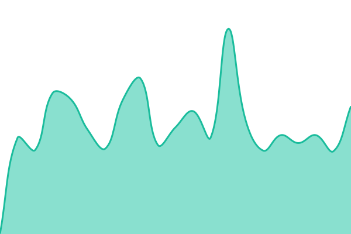
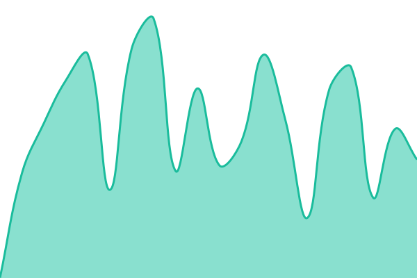
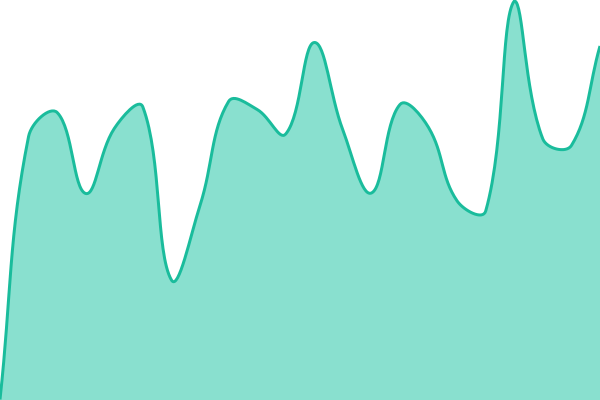

# [📈 Live Status](https://inl.github.io/ivdnt-statusoverzicht/): <!--live status--> **🟩 All systems operational**

This repository contains the open-source uptime monitor and status page for [Dutch Language Institute](https://www.ivdnt.org), powered by [Upptime](https://github.com/upptime/upptime).

With [Upptime](https://upptime.js.org), you can get your own unlimited and free uptime monitor and status page, powered entirely by a GitHub repository. We use [Issues](https://github.com/INL/ivdnt-statusoverzicht/issues) as incident reports, [Actions](https://github.com/INL/ivdnt-statusoverzicht/actions) as uptime monitors, and [Pages](https://inl.github.io/ivdnt-statusoverzicht/) for the status page.

<!--start: status pages-->
<!-- This summary is generated by Upptime (https://github.com/upptime/upptime) -->
<!-- Do not edit this manually, your changes will be overwritten -->
<!-- prettier-ignore -->
| URL | Status | History | Response Time | Uptime |
| --- | ------ | ------- | ------------- | ------ |
|  [ivdnt.org](https://ivdnt.org) | 🟩 Up | [ivdnt-org.yml](https://github.com/instituutnederlandsetaal/ivdnt-statusoverzicht/commits/HEAD/history/ivdnt-org.yml) | 

 1143ms
     
 | 

<a href="https://status.ivdnt.org/history/ivdnt-org">100.00%</a>
    

|  [anw.ivdnt.org](https://anw.ivdnt.org) | 🟩 Up | [anw-ivdnt-org.yml](https://github.com/instituutnederlandsetaal/ivdnt-statusoverzicht/commits/HEAD/history/anw-ivdnt-org.yml) | 

 1537ms
     
 | 

<a href="https://status.ivdnt.org/history/anw-ivdnt-org">100.00%</a>
    

|  [brievenalsbuit.ivdnt.org](https://brievenalsbuit.ivdnt.org) | 🟩 Up | [brievenalsbuit-ivdnt-org.yml](https://github.com/instituutnederlandsetaal/ivdnt-statusoverzicht/commits/HEAD/history/brievenalsbuit-ivdnt-org.yml) | 

 914ms
     
 | 

<a href="https://status.ivdnt.org/history/brievenalsbuit-ivdnt-org">100.00%</a>
    

|  [brievenalsbuit2.ivdnt.org](https://brievenalsbuit2.ivdnt.org) | 🟩 Up | [brievenalsbuit2-ivdnt-org.yml](https://github.com/instituutnederlandsetaal/ivdnt-statusoverzicht/commits/HEAD/history/brievenalsbuit2-ivdnt-org.yml) | 

 894ms
     
 | 

<a href="https://status.ivdnt.org/history/brievenalsbuit2-ivdnt-org">100.00%</a>
    

|  [chn.ivdnt.org](chn.ivdnt.org) | 🟩 Up | [chn-ivdnt-org.yml](https://github.com/instituutnederlandsetaal/ivdnt-statusoverzicht/commits/HEAD/history/chn-ivdnt-org.yml) | 

 810ms
     
 | 

<a href="https://status.ivdnt.org/history/chn-ivdnt-org">100.00%</a>
    

|  [clarin-be.ivdnt.org](https://clarin-be.ivdnt.org) | 🟩 Up | [clarin-be-ivdnt-org.yml](https://github.com/instituutnederlandsetaal/ivdnt-statusoverzicht/commits/HEAD/history/clarin-be-ivdnt-org.yml) | 

 988ms
     
 | 

<a href="https://status.ivdnt.org/history/clarin-be-ivdnt-org">100.00%</a>
    

|  [corpusgysseling.ivdnt.org](https://corpusgysseling.ivdnt.org) | 🟩 Up | [corpusgysseling-ivdnt-org.yml](https://github.com/instituutnederlandsetaal/ivdnt-statusoverzicht/commits/HEAD/history/corpusgysseling-ivdnt-org.yml) | 

 1016ms
     
 | 

<a href="https://status.ivdnt.org/history/corpusgysseling-ivdnt-org">100.00%</a>
    

|  [corpusjuridischnederlands.ivdnt.org](https://corpusjuridischnederlands.ivdnt.org) | 🟩 Up | [corpusjuridischnederlands-ivdnt-org.yml](https://github.com/instituutnederlandsetaal/ivdnt-statusoverzicht/commits/HEAD/history/corpusjuridischnederlands-ivdnt-org.yml) | 

 952ms
     
 | 

<a href="https://status.ivdnt.org/history/corpusjuridischnederlands-ivdnt-org">100.00%</a>
    

|  [corpusmiddelnederlands.ivdnt.org](https://corpusmiddelnederlands.ivdnt.org) | 🟩 Up | [corpusmiddelnederlands-ivdnt-org.yml](https://github.com/instituutnederlandsetaal/ivdnt-statusoverzicht/commits/HEAD/history/corpusmiddelnederlands-ivdnt-org.yml) | 

 848ms
     
 | 

<a href="https://status.ivdnt.org/history/corpusmiddelnederlands-ivdnt-org">100.00%</a>
    

|  [corpusoudfries.ivdnt.org](https://corpusoudfries.ivdnt.org) | 🟩 Up | [corpusoudfries-ivdnt-org.yml](https://github.com/instituutnederlandsetaal/ivdnt-statusoverzicht/commits/HEAD/history/corpusoudfries-ivdnt-org.yml) | 

 969ms
     
 | 

<a href="https://status.ivdnt.org/history/corpusoudfries-ivdnt-org">100.00%</a>
    

|  [corpusoudnederlands.ivdnt.org](https://corpusoudnederlands.ivdnt.org) | 🟩 Up | [corpusoudnederlands-ivdnt-org.yml](https://github.com/instituutnederlandsetaal/ivdnt-statusoverzicht/commits/HEAD/history/corpusoudnederlands-ivdnt-org.yml) | 

 944ms
     
 | 

<a href="https://status.ivdnt.org/history/corpusoudnederlands-ivdnt-org">100.00%</a>
    

|  [couranten.ivdnt.org](https://couranten.ivdnt.org) | 🟩 Up | [couranten-ivdnt-org.yml](https://github.com/instituutnederlandsetaal/ivdnt-statusoverzicht/commits/HEAD/history/couranten-ivdnt-org.yml) | 

 1014ms
     
 | 

<a href="https://status.ivdnt.org/history/couranten-ivdnt-org">100.00%</a>
    

|  [dagenta.ivdnt.org](https://dagenta.ivdnt.org) | 🟩 Up | [dagenta-ivdnt-org.yml](https://github.com/instituutnederlandsetaal/ivdnt-statusoverzicht/commits/HEAD/history/dagenta-ivdnt-org.yml) | 

 1585ms
     
 | 

<a href="https://status.ivdnt.org/history/dagenta-ivdnt-org">100.00%</a>
    

|  [diamant.ivdnt.org](https://diamant.ivdnt.org) | 🟩 Up | [diamant-ivdnt-org.yml](https://github.com/instituutnederlandsetaal/ivdnt-statusoverzicht/commits/HEAD/history/diamant-ivdnt-org.yml) | 

 811ms
     
 | 

<a href="https://status.ivdnt.org/history/diamant-ivdnt-org">100.00%</a>
    

|  [dsdd.ivdnt.org](https://dsdd.ivdnt.org/DSDD) | 🟩 Up | [dsdd-ivdnt-org.yml](https://github.com/instituutnederlandsetaal/ivdnt-statusoverzicht/commits/HEAD/history/dsdd-ivdnt-org.yml) | 

 1236ms
     
 | 

<a href="https://status.ivdnt.org/history/dsdd-ivdnt-org">100.00%</a>
    

|  [e-ans.ivdnt.org](https://e-ans.ivdnt.org) | 🟩 Up | [e-ans-ivdnt-org.yml](https://github.com/instituutnederlandsetaal/ivdnt-statusoverzicht/commits/HEAD/history/e-ans-ivdnt-org.yml) | 

 1165ms
     
 | 

<a href="https://status.ivdnt.org/history/e-ans-ivdnt-org">100.00%</a>
    

|  [etymologiebank.ivdnt.org](https://etymologiebank.ivdnt.org) | 🟩 Up | [etymologiebank-ivdnt-org.yml](https://github.com/instituutnederlandsetaal/ivdnt-statusoverzicht/commits/HEAD/history/etymologiebank-ivdnt-org.yml) | 

 1673ms
     
 | 

<a href="https://status.ivdnt.org/history/etymologiebank-ivdnt-org">100.00%</a>
    

|  [ewnd.ivdnt.org](https://ewnd.ivdnt.org) | 🟩 Up | [ewnd-ivdnt-org.yml](https://github.com/instituutnederlandsetaal/ivdnt-statusoverzicht/commits/HEAD/history/ewnd-ivdnt-org.yml) | 

 393ms
     
 | 

<a href="https://status.ivdnt.org/history/ewnd-ivdnt-org">96.90%</a>
    

|  [fineco.ivdnt.org](https://fineco.ivdnt.org) | 🟩 Up | [fineco-ivdnt-org.yml](https://github.com/instituutnederlandsetaal/ivdnt-statusoverzicht/commits/HEAD/history/fineco-ivdnt-org.yml) | 

 521ms
     
 | 

<a href="https://status.ivdnt.org/history/fineco-ivdnt-org">100.00%</a>
    

|  [gekaaptebrieven.ivdnt.org](https://gekaaptebrieven.ivdnt.org) | 🟩 Up | [gekaaptebrieven-ivdnt-org.yml](https://github.com/instituutnederlandsetaal/ivdnt-statusoverzicht/commits/HEAD/history/gekaaptebrieven-ivdnt-org.yml) | 

 919ms
     
 | 

<a href="https://status.ivdnt.org/history/gekaaptebrieven-ivdnt-org">100.00%</a>
    

|  [glad.ivdnt.org](https://glad.ivdnt.org) | 🟩 Up | [glad-ivdnt-org.yml](https://github.com/instituutnederlandsetaal/ivdnt-statusoverzicht/commits/HEAD/history/glad-ivdnt-org.yml) | 

 1017ms
     
 | 

<a href="https://status.ivdnt.org/history/glad-ivdnt-org">100.00%</a>
    

|  [gretel4.ivdnt.org](https://gretel4.ivdnt.org) | 🟩 Up | [gretel4-ivdnt-org.yml](https://github.com/instituutnederlandsetaal/ivdnt-statusoverzicht/commits/HEAD/history/gretel4-ivdnt-org.yml) | 

 737ms
     
 | 

<a href="https://status.ivdnt.org/history/gretel4-ivdnt-org">100.00%</a>
    

|  [gtb.ivdnt.org](https://gtb.ivdnt.org) | 🟩 Up | [gtb-ivdnt-org.yml](https://github.com/instituutnederlandsetaal/ivdnt-statusoverzicht/commits/HEAD/history/gtb-ivdnt-org.yml) | 

 597ms
     
 | 

<a href="https://status.ivdnt.org/history/gtb-ivdnt-org">100.00%</a>
    

|  [hcd.ivdnt.org](https://hcd.ivdnt.org/blacklab-frontend/HCD/search) | 🟩 Up | [hcd-ivdnt-org.yml](https://github.com/instituutnederlandsetaal/ivdnt-statusoverzicht/commits/HEAD/history/hcd-ivdnt-org.yml) | 

 514ms
     
 | 

<a href="https://status.ivdnt.org/history/hcd-ivdnt-org">100.00%</a>
    

|  [jiddischwoordenboek.nl](https://jiddischwoordenboek.nl) | 🟩 Up | [jiddischwoordenboek-nl.yml](https://github.com/instituutnederlandsetaal/ivdnt-statusoverzicht/commits/HEAD/history/jiddischwoordenboek-nl.yml) | 

 470ms
     
 | 

<a href="https://status.ivdnt.org/history/jiddischwoordenboek-nl">100.00%</a>
    

|  [jwsii.ivdnt.org](https://jwsii.ivdnt.org) | 🟩 Up | [jwsii-ivdnt-org.yml](https://github.com/instituutnederlandsetaal/ivdnt-statusoverzicht/commits/HEAD/history/jwsii-ivdnt-org.yml) | 

 464ms
     
 | 

<a href="https://status.ivdnt.org/history/jwsii-ivdnt-org">100.00%</a>
    

|  [kdutch.ivdnt.org](https://kdutch.ivdnt.org) | 🟩 Up | [kdutch-ivdnt-org.yml](https://github.com/instituutnederlandsetaal/ivdnt-statusoverzicht/commits/HEAD/history/kdutch-ivdnt-org.yml) | 

 1144ms
     
 | 

<a href="https://status.ivdnt.org/history/kdutch-ivdnt-org">100.00%</a>
    

|  [kennisbank-begrijpelijketaal.nl](https://kennisbank-begrijpelijketaal.nl) | 🟩 Up | [kennisbank-begrijpelijketaal-nl.yml](https://github.com/instituutnederlandsetaal/ivdnt-statusoverzicht/commits/HEAD/history/kennisbank-begrijpelijketaal-nl.yml) | 

 557ms
     
 | 

<a href="https://status.ivdnt.org/history/kennisbank-begrijpelijketaal-nl">96.91%</a>
    

|  [lexiconfrisicum.ivdnt.org](https://lexiconfrisicum.ivdnt.org) | 🟩 Up | [lexiconfrisicum-ivdnt-org.yml](https://github.com/instituutnederlandsetaal/ivdnt-statusoverzicht/commits/HEAD/history/lexiconfrisicum-ivdnt-org.yml) | 

 467ms
     
 | 

<a href="https://status.ivdnt.org/history/lexiconfrisicum-ivdnt-org">100.00%</a>
    

|  [limburgsluisteren.ivdnt.org](https://limburgsluisteren.ivdnt.org) | 🟩 Up | [limburgsluisteren-ivdnt-org.yml](https://github.com/instituutnederlandsetaal/ivdnt-statusoverzicht/commits/HEAD/history/limburgsluisteren-ivdnt-org.yml) | 

 805ms
     
 | 

<a href="https://status.ivdnt.org/history/limburgsluisteren-ivdnt-org">100.00%</a>
    

|  [lol.ivdnt.org](https://lol.ivdnt.org) | 🟩 Up | [lol-ivdnt-org.yml](https://github.com/instituutnederlandsetaal/ivdnt-statusoverzicht/commits/HEAD/history/lol-ivdnt-org.yml) | 

 499ms
     
 | 

<a href="https://status.ivdnt.org/history/lol-ivdnt-org">100.00%</a>
    

|  [mateo.ivdnt.org](https://mateo.ivdnt.org) | 🟩 Up | [mateo-ivdnt-org.yml](https://github.com/instituutnederlandsetaal/ivdnt-statusoverzicht/commits/HEAD/history/mateo-ivdnt-org.yml) | 

 470ms
     
 | 

<a href="https://status.ivdnt.org/history/mateo-ivdnt-org">100.00%</a>
    

|  [meldpunttaal.ivdnt.org](https://meldpunttaal.ivdnt.org) | 🟩 Up | [meldpunttaal-ivdnt-org.yml](https://github.com/instituutnederlandsetaal/ivdnt-statusoverzicht/commits/HEAD/history/meldpunttaal-ivdnt-org.yml) | 

 478ms
     
 | 

<a href="https://status.ivdnt.org/history/meldpunttaal-ivdnt-org">100.00%</a>
    

|  [neerlandistiek.nl](https://neerlandistiek.nl) | 🟩 Up | [neerlandistiek-nl.yml](https://github.com/instituutnederlandsetaal/ivdnt-statusoverzicht/commits/HEAD/history/neerlandistiek-nl.yml) | 

 1184ms
     
 | 

<a href="https://status.ivdnt.org/history/neerlandistiek-nl">100.00%</a>
    

|  [nederlandsedialecten.org](https://nederlandsedialecten.org) | 🟩 Up | [nederlandsedialecten-org.yml](https://github.com/instituutnederlandsetaal/ivdnt-statusoverzicht/commits/HEAD/history/nederlandsedialecten-org.yml) | 

 1286ms
     
 | 

<a href="https://status.ivdnt.org/history/nederlandsedialecten-org">100.00%</a>
    

|  [neologismen.ivdnt.org](https://neologismen.ivdnt.org) | 🟩 Up | [neologismen-ivdnt-org.yml](https://github.com/instituutnederlandsetaal/ivdnt-statusoverzicht/commits/HEAD/history/neologismen-ivdnt-org.yml) | 

 1584ms
     
 | 

<a href="https://status.ivdnt.org/history/neologismen-ivdnt-org">100.00%</a>
    

|  [opensonar.ivdnt.org](https://portal.clarin.inl.nl/opensonar_frontend/opensonar) | 🟩 Up | [opensonar-ivdnt-org.yml](https://github.com/instituutnederlandsetaal/ivdnt-statusoverzicht/commits/HEAD/history/opensonar-ivdnt-org.yml) | 

 2249ms
     
 | 

<a href="https://status.ivdnt.org/history/opensonar-ivdnt-org">100.00%</a>
    

|  [overtaal.be](https://overtaal.be) | 🟩 Up | [overtaal-be.yml](https://github.com/instituutnederlandsetaal/ivdnt-statusoverzicht/commits/HEAD/history/overtaal-be.yml) | 

 1127ms
     
 | 

<a href="https://status.ivdnt.org/history/overtaal-be">100.00%</a>
    

|  [pallas.ivdnt.org](https://pallas.ivdnt.org) | 🟩 Up | [pallas-ivdnt-org.yml](https://github.com/instituutnederlandsetaal/ivdnt-statusoverzicht/commits/HEAD/history/pallas-ivdnt-org.yml) | 

 998ms
     
 | 

<a href="https://status.ivdnt.org/history/pallas-ivdnt-org">100.00%</a>
    

|  [picto.ivdnt.org](https://picto.ivdnt.org) | 🟩 Up | [picto-ivdnt-org.yml](https://github.com/instituutnederlandsetaal/ivdnt-statusoverzicht/commits/HEAD/history/picto-ivdnt-org.yml) | 

 459ms
     
 | 

<a href="https://status.ivdnt.org/history/picto-ivdnt-org">100.00%</a>
    

|  [pinkhof.ivdnt.org](https://pinkhof.ivdnt.org) | 🟩 Up | [pinkhof-ivdnt-org.yml](https://github.com/instituutnederlandsetaal/ivdnt-statusoverzicht/commits/HEAD/history/pinkhof-ivdnt-org.yml) | 

 500ms
     
 | 

<a href="https://status.ivdnt.org/history/pinkhof-ivdnt-org">100.00%</a>
    

|  [portal.clarin.ivdnt.org](https://portal.clarin.ivdnt.org) | 🟩 Up | [portal-clarin-ivdnt-org.yml](https://github.com/instituutnederlandsetaal/ivdnt-statusoverzicht/commits/HEAD/history/portal-clarin-ivdnt-org.yml) | 

 604ms
     
 | 

<a href="https://status.ivdnt.org/history/portal-clarin-ivdnt-org">100.00%</a>
    

|  [sabed.ivdnt.org](https://sabed.ivdnt.org) | 🟩 Up | [sabed-ivdnt-org.yml](https://github.com/instituutnederlandsetaal/ivdnt-statusoverzicht/commits/HEAD/history/sabed-ivdnt-org.yml) | 

 927ms
     
 | 

<a href="https://status.ivdnt.org/history/sabed-ivdnt-org">100.00%</a>
    

|  [schatkamer.ivdnt.org](https://schatkamer.ivdnt.org) | 🟩 Up | [schatkamer-ivdnt-org.yml](https://github.com/instituutnederlandsetaal/ivdnt-statusoverzicht/commits/HEAD/history/schatkamer-ivdnt-org.yml) | 

 945ms
     
 | 

<a href="https://status.ivdnt.org/history/schatkamer-ivdnt-org">100.00%</a>
    

|  [scheikunde.ivdnt.org](https://scheikunde.ivdnt.org) | 🟩 Up | [scheikunde-ivdnt-org.yml](https://github.com/instituutnederlandsetaal/ivdnt-statusoverzicht/commits/HEAD/history/scheikunde-ivdnt-org.yml) | 

 463ms
     
 | 

<a href="https://status.ivdnt.org/history/scheikunde-ivdnt-org">100.00%</a>
    

|  [sofeer.ivdnt.org](https://sofeer.ivdnt.org) | 🟩 Up | [sofeer-ivdnt-org.yml](https://github.com/instituutnederlandsetaal/ivdnt-statusoverzicht/commits/HEAD/history/sofeer-ivdnt-org.yml) | 

 745ms
     
 | 

<a href="https://status.ivdnt.org/history/sofeer-ivdnt-org">100.00%</a>
    

|  [taaladvies.net](https://taaladvies.net) | 🟩 Up | [taaladvies-net.yml](https://github.com/instituutnederlandsetaal/ivdnt-statusoverzicht/commits/HEAD/history/taaladvies-net.yml) | 

 1123ms
     
 | 

<a href="https://status.ivdnt.org/history/taaladvies-net">100.00%</a>
    

|  [taalmaterialen.ivdnt.org](https://taalmaterialen.ivdnt.org) | 🟩 Up | [taalmaterialen-ivdnt-org.yml](https://github.com/instituutnederlandsetaal/ivdnt-statusoverzicht/commits/HEAD/history/taalmaterialen-ivdnt-org.yml) | 

 849ms
     
 | 

<a href="https://status.ivdnt.org/history/taalmaterialen-ivdnt-org">100.00%</a>
    

|  [transcriptor.nl](https://transcriptor.nl) | 🟩 Up | [transcriptor-nl.yml](https://github.com/instituutnederlandsetaal/ivdnt-statusoverzicht/commits/HEAD/history/transcriptor-nl.yml) | 

 487ms
     
 | 

<a href="https://status.ivdnt.org/history/transcriptor-nl">100.00%</a>
    

|  [uitleenwoordenbank.ivdnt.org](https://uitleenwoordenbank.ivdnt.org) | 🟩 Up | [uitleenwoordenbank-ivdnt-org.yml](https://github.com/instituutnederlandsetaal/ivdnt-statusoverzicht/commits/HEAD/history/uitleenwoordenbank-ivdnt-org.yml) | 

 515ms
     
 | 

<a href="https://status.ivdnt.org/history/uitleenwoordenbank-ivdnt-org">96.92%</a>
    

|  [vertaalwoordenschat.ivdnt.org](https://vertaalwoordenschat.ivdnt.org) | 🟩 Up | [vertaalwoordenschat-ivdnt-org.yml](https://github.com/instituutnederlandsetaal/ivdnt-statusoverzicht/commits/HEAD/history/vertaalwoordenschat-ivdnt-org.yml) | 

 1220ms
     
 | 

<a href="https://status.ivdnt.org/history/vertaalwoordenschat-ivdnt-org">100.00%</a>
    

|  [woordcombinaties.ivdnt.org](https://woordcombinaties.ivdnt.org) | 🟩 Up | [woordcombinaties-ivdnt-org.yml](https://github.com/instituutnederlandsetaal/ivdnt-statusoverzicht/commits/HEAD/history/woordcombinaties-ivdnt-org.yml) | 

 470ms
     
 | 

<a href="https://status.ivdnt.org/history/woordcombinaties-ivdnt-org">100.00%</a>
    

|  [woordenlijst.org](https://woordenlijst.org) | 🟩 Up | [woordenlijst-org.yml](https://github.com/instituutnederlandsetaal/ivdnt-statusoverzicht/commits/HEAD/history/woordenlijst-org.yml) | 

 904ms
     
 | 

<a href="https://status.ivdnt.org/history/woordenlijst-org">100.00%</a>
    

|  [woordpeiler.ivdnt.org](https://woordpeiler.ivdnt.org) | 🟩 Up | [woordpeiler-ivdnt-org.yml](https://github.com/instituutnederlandsetaal/ivdnt-statusoverzicht/commits/HEAD/history/woordpeiler-ivdnt-org.yml) | 

 474ms
     
 | 

<a href="https://status.ivdnt.org/history/woordpeiler-ivdnt-org">100.00%</a>
    

|  [wow.ivdnt.org](https://wow.ivdnt.org) | 🟩 Up | [wow-ivdnt-org.yml](https://github.com/instituutnederlandsetaal/ivdnt-statusoverzicht/commits/HEAD/history/wow-ivdnt-org.yml) | 

 873ms
     
 | 

<a href="https://status.ivdnt.org/history/wow-ivdnt-org">100.00%</a>
    

<!--end: status pages-->

[**Visit our status website →**](https://inl.github.io/ivdnt-statusoverzicht/)

## 📄 License

- Powered by: [Upptime](https://github.com/upptime/upptime)
- Code: [MIT](./LICENSE) © [Dutch Language Institute](https://www.ivdnt.org)
- Data in the `./history` directory: [Open Database License](https://opendatacommons.org/licenses/odbl/1-0/)
